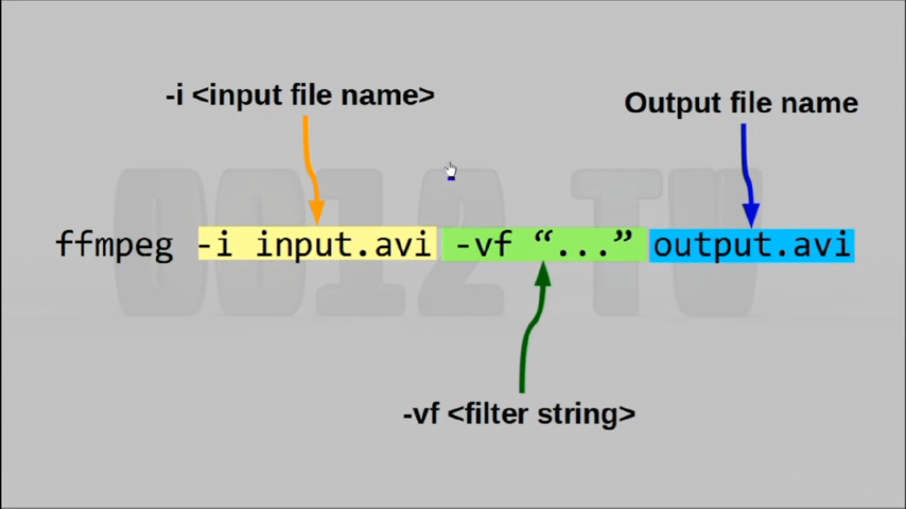

# SSH SETUP

* Home directory on the server should not be writable by others:

    ```h
    chmod go-w /home/$USER
    ```

* SSH folder on the server needs 700 permissions:
    ```h
    chmod 700 /home/$USER/.ssh
    ```

* Authorized_keys file needs 644 permissions:
    ```h
    chmod 644 /home/$USER/.ssh/authorized_keys
    ```

* Make sure that user owns the files/folders and not root:
    ```h
    chown user:user authorized_keys and chown user:user /home/$USER/.ssh
    ```

## Put the generated public key (from ssh-keygen) in the user's authorized_keys file on the server

Make sure that user's home directory is set to what you expect it to be and that it contains the correct .ssh folder that you've been modifying.

If not, use:

```h
usermod -d /home/$USER $USER
```

to fix the issue.
_____
**Finally**, restart ssh:

```h
  service ssh restart
  ```

Then make sure client has the public key and private key files in the local user's .ssh folder and login:

```h
ssh user@host.com
```

_____


![Alternate text][ref]

...

[ref]: sshconfig.PNG "Optional title"